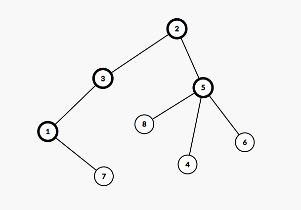

## Rezolvare varianta sesiune speciala 2025

### Subiectul I

1. Rezolvare:
    - a => din prima stim ca nu e adevarat deoarece avem x <= `m` si ar fi trebuie sa avem x >= `m`
    - b => Din nou aceeasi chestie cu x <=`m`
    - c => ar fi fost adevarat dar problema este cu operatorul || datorita caruia nu se verifica cerinta
    - d => Este adevarat deoarece stim:
        - x >= `m` dar mai mic sau egal cu `p` sau mai mic sau egal cu `n` dar mai mare sau egal cu `q` lucru ce respecta cerinta
    - Raspuns corect: `d`

2. Rezolvare:
    ```json
        f(2050)
            afiseaza `2050`
            n % 10 != 0 fals
            n != 0 adevarat => calculam f(205) si la intoarcere afisam 2050
                f(205)
                    afiseaza `205`
                    n % 10 != 0 adevarat =>
                        afisez 205 si calculez f(20) =>
                    f(20)
                        afiseaza `20` 
                        n % 10 != 0 fals
                        n != 0 adevarat => calculam f(2) si la intoarcere afisam 20
                        f (2) =>
                            afisez 2
                            n % 10 != 0  afisez 2 si calculez f(0) => afiseaza 0 si acum afisam ce a mai ramas adica  20 2050
        2050 205 205 20 2 2 0 20 2050
    ```
    - Raspuns corect: `C`

3. Rezolvare:
    ```json
        Avem:
        subiect, predicat, atribut, complement

        Stim ca atributul trebuie sa fie imediat inainte sau imediat dupa subiect
    
        Primele 4 solutii generate:
        (subiect, atribut, predicat,complement)
        (subiect, atribut, complement, predicat)
        (predicat, subiect, atribut, complement)
        (predicat, atribut, subiect, complement)


        Putem observa ca se fac toate combinatiile si astfel ultima combinatie trebuie sa inceapa cu complement, urmata de atribut, subiect si predicat.
    ```
    - Raspuns corect: `a`
4. Rezolvare:
    ```json
        Stim ca un element se afla pe diagonala principala daca si nu mai daca indicele liniei este egal cu indicele coloanei.
        Deci avem de ales intre m[16][16] si m(16,16) si cum ultima este invalida din punct de vedere sintactic, avem raspuns corect: b
    ```
    - Raspuns corect: `B`
5. Rezolvare:
   ```json
       1. Situația inițială

        Avem un graf complet cu 7 noduri
        „Complet” înseamnă că fiecare nod este legat de fiecare alt nod.
        
        Numărul total de muchii este Combinari de 7 luate cate 2 = 21 (asta e formula pentru a alege câte perechi de noduri există).
        
        2. Ce ni se cere ?
        Să eliminăm cât mai puține muchii astfel încât:
        graful să se „rupă” în două componente conexe (adică să se împartă în două grupuri de noduri între care nu mai există muchii),
        fiecare componentă să aibă cel puțin 2 noduri.
        
        3. Cum se face „ruperea” grafului
        Dacă vrem să împărțim cele 7 noduri în două grupuri, toate muchiile dintre cele două grupuri trebuie eliminate (altfel graful ar fi în                continuare legat).
        Deci problema se reduce la: în câte muchii trebuie să tai legătura dintre cele două grupuri de noduri?
        
        4. Cazurile posibile
        
        Împărțirea nodurilor se poate face așa:
        
        Grup de 2 noduri și grup de 5 noduri → muchii de tăiat: 2x5=10
        Grup de 3 noduri și grup de 4 noduri → muchii de tăiat: 3x4 = 12.
        
        5. Care e minimul?
        
        Cel mai mic număr de muchii eliminate este 10 (în cazul 2–5).
        
   ```
   - Raspuns corect: `C`

### Subiectul II

1. Rezolvare:
    - a
        ```json
            m=75;n=90
            pentru i = 90
                x = 90
                c = 0
                repeta
                    x = 9
                pana cand x%10!= 0
                daca x == 0 fals
            pentru i = 89
                x = 89
                c = 9
                repeta
                    x = 8
                pana cand x%10 != 9 true
                daca x == 0 fals
            pentru i = 88
                x = 88
                c = 8
            repeta
                x = 8
            paba cand x%10 != 8
            repeta
                x = 0
            pana cand x%10 != 8 true
            daca x == 0 true => scrie i >> scrie 88

            ...
            OBSERVAM ca algoritmul afiseaza numerele care sunt formate din aceleasi cifre din intervalul[n,m] adica 88 77 in cazul de fata
        ```
    - b
        ```json
            2222, 2223
        ```
    - c
        ```c++
            #include <iostream>

            using namespace std;

            int main() {

                int m,n;
                cin >> m >> n;
                for (int i = n; i>=m; i--) {
                    int x = i;
                    int c = x%10;
                    do {
                        x = x/10;
                    } while (x%10==c);

                    if (x == 0) {
                        cout << i << " ";
                    }
                }

                return 0;
            }

        ```
    - d
        ```json
            citește m,n
            (numere naturale nenule, m≤n)
            i<-n
            ┌cat timp i>=m execută
            │ x<-i
            │ c<-x%10
            │┌repetă
            ││ x<-[x/10]
            │└până când x%10≠c
            │┌dacă x=0 atunci
            ││ scrie i,' '
            │└■
            | i <- i-1
            └■
        ```

2. Rezolvare
    - Din vectorul de tati avem urmatorul arbore
    ``` json
        1 2 3 4 5 6 7 8
        3 0 2 5 2 5 1 5

        radacina 2
        2 -> 3,5
        3 -> 1
        5 -> 4,6,8
        1 - 7
    ```
    
    Si observam ca nodul 4 are ca si frati nodurile 8,6
    Si mai observam ca daca alegem nodurile 7,3, sau 1 ca si radacina, nodul 4 va avea aceeasi frati.

3. Rezolvare
    ```c++
        #include <iostream>
        using namespace std;

        struct punct {
            int x,y;
        };
        struct figura {
            punct A, B;
        } d;
        int main() {
            //Deoarece avem coordonatele la punctul din stanga sus A(x1,y1) si dreapta jos B(x2,y2) pentru a demonstra
            // Pentru a demonstra ca este un patrat trebuie sa aratam ca inaltimea este egala cu lungimea
            // Citim coordonatele punctelor
            // Nota: pentru bac ai nevoie sa scrii pe foaie doar ce este intre liniile hasurate.
            cin >> d.A.x >> d.A.y >> d.B.x >> d.B.y;
            //-----------------------------------------------------------
            int inaltime, lungime;
            if (d.A.y > d.B.y ) {
                inaltime = d.A.y - d.B.y;
            } else {
                inaltime = d.B.y - d.A.y;
            }

            if (d.A.x > d.B.x ) {
                lungime = d.A.x - d.B.x;
            } else {
                lungime = d.B.x - d.A.x;
            }

            if (lungime == inaltime) {
                cout << "DA";
            } else {
                cout << "NU";
            }
            //---------------------------------------------
            return 0;
        }
    ```

### Subiectul III

1. Rezolvare:
    ```c++
        #include <iostream>
        #include <cmath>
        using namespace std;

        int diviz (int n);
        int diviz2 (int n);

        int main() {
            cout << diviz(72) << endl;
            cout << diviz(16) <<  endl;
            cout << diviz(1);

            cout << endl << endl;
            cout << diviz2(72) << endl;
            cout << diviz2(16) <<  endl;
            cout << diviz2(1);
            return 0;
        }


        int diviz (int n) {
            int rezultat = 1;
            for (int i = n; i>=1; i--) {
                int estePatratPerfect = 0;
                if (n%i == 0) {
                    for (int j = 0; j * j <= i; j++) {
                        if (j * j == i) {
                            estePatratPerfect = 1;
                            break;
                        }
                    }
                }
                if (estePatratPerfect) {
                    rezultat = i;
                }
            }
            return rezultat;
        }

        //O alta varianta mai simpla dar care foloseste functia sqrt mai jos
        int diviz2 (int n) {
            int rezultat = 1;
            for (int i = n; i>=1; i--) {
                if (n%i == 0) {
                    int radacina = sqrt(i);
                    if (radacina * radacina == i) {
                        rezultat = i;
                    }
                }

            }
            return rezultat;
        }
    ```

2. Rezolvare:
    ```c++
        #include <iostream>
        #include <cstring>
        using namespace std;

        int main() {
            char text[101];
            char rezultat[201]="";
            cin.getline(text, 200);
            char*cuvant = strtok(text," ");
            while (cuvant != NULL) {
                strcat(rezultat, cuvant);
                cuvant = strtok(NULL, " ");
                if (cuvant != NULL) {
                    strcat(rezultat," - ");
                }
            }

            cout << rezultat;
            return 0;
        }
    ```

3. Rezolvare:
    - a
        ```json
            O sa implementam un algortim care citeste cate o tripleta odata. Pentru fiecare tripleta, trebuie sa verificam daca aceasta poate fi un triunghi dreptunghic si aici aplicam teorema lui pitagora, adica patratul ipotenuzei sa fie egal cu suma patratelor catetelor. Insa deoarece problema nu ne spune exact care e ipotenuza, stiim ca aceasta trebuie sa fie cea mai mare valoare dintre cele 3. Deci o sa scriem doua subprograme: unul care va sti sa calculeze maximul a 3 numere si celalalt care se va folosi de acesta pentru a determina daca o tripleta poate sau nu sa fie un triunghi dreptunghic, aplicand si teorema lui pitagora. Dupa aceea, parcurgem fisierul, tripleta cu tripleta, si daca aceasta reprezinta un triunghi dreptunghic atunci o sa punem intr-un vector de frecventa valoarea ipotenuzei pe care o extragem cu subprogramul care stie sa calculeze maximul a 3 numere.
            Dupa ce am terminat de parcurs fisierul, parcurgem vectorul de frecventa si vedem care este valoarea cu cel mai mare numar de aparitii, dupa care o afisam. 
            Algoritmul este eficient din punct de vedere al timpului de executie deoarece fisierul este parcurs o singura data.
        ```
    - b
        ```c++
            #include <iostream>
            #include <fstream>

            using namespace std;

            int max(int, int, int);
            int esteDreptunghic(int, int, int);

            int main() {

                int l1, l2, l3;
                ifstream fin("bac.txt");
                int frecventa[101] = {0};
                while (fin >> l1 >> l2 >> l3) {
                    if (esteDreptunghic(l1, l2, l3)) {
                        int ipotenuza = max(l1, l2, l3);
                        frecventa[ipotenuza]++;
                    }
                }

                int maxim = frecventa[0];
                for (int i = 1; i < 101; i++) {
                    if (maxim < frecventa[i]) {
                        maxim = frecventa[i];
                    }
                }

                cout << maxim;

                fin.close();
                return 0;
            }


            int esteDreptunghic(int l1, int l2, int l3) {
                int maxim = max(l1, l2, l3);
                if (l1 == maxim) {
                    return l1 * l1 == l2 * l2 + l3 * l3;
                } else if (l2 == maxim) {
                    return l2 * l2 == l3 * l3 + l1 * l1;
                } else {
                    return l3 * l3 == l2 * l2 + l1 * l1;
                }
            }

            int max(int a, int b, int c) {
                int maxim = a;
                if (b > maxim) maxim = b;
                if (c > maxim) maxim = c;
                return maxim;
            }
        ```
