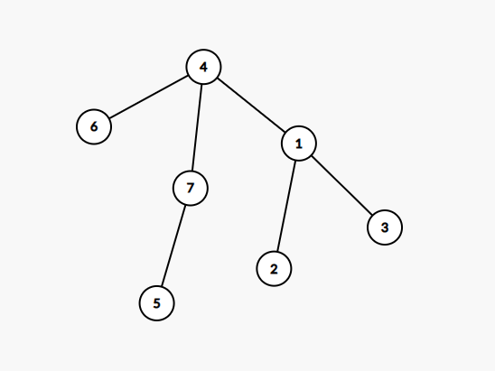
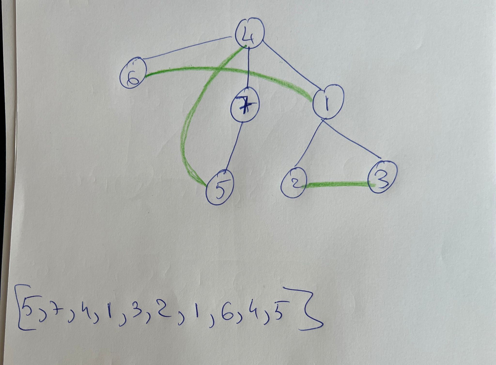

# Sesiunea 5

## Agenda

- Verificare exercitii tema anterioara (focus pe sortare)
- Verificare/Rezolvare varianta Simulare Bac 2023
- Introducere in structuri
- Exercitii/Tema

## Verificare exercitii tema anterioara (focus pe sortare)

- Exemplu sortare vector ce contine numere folosind metoda bulelor (BubbleSort)

    ```c++
        #include<iostream>
        using namespace std;
        int main()
        {
        int numere[] = {1,3,2,4,6,43,21,23,54,32, 12,11, 9,8,7,5};
        int lungimeSirNumere = sizeof(numere)/sizeof(numere[0]);

        cout << "Sirul inainte de sortare: ";
        for (int i = 0; i < lungimeSirNumere; i++) {
            cout << numere[i] << " ";
        }
        cout << endl;
        
        
        for (int i = 0; i < lungimeSirNumere; i++) {
            for (int j = 0; j < lungimeSirNumere-1; j++) {
                if (numere[j] > numere[j+1]) {
                    int temp = numere[j];
                    numere[j] = numere[j+1];
                    numere[j+1] = temp;
                }
            }
        }


        // Varianta imbunatatita => Deoarece in timpul swap-ului, numerele cele mari se muta automat la final
        // astfel ca nu mai este nevoie sa parcurgem tot sirul de fiecare data si mergem pana la lungimeSirNumere -i -1
        // for (int i = 0; i < lungimeSirNumere; i++) {
        //    for (int j = 0; j < lungimeSirNumere - i - 1; j++) {
        //       if (numere[j] > numere[j + 1]) {
        //          int temp = numere[j];
        //          numere[j] = numere[j + 1];
        //          numere[j + 1] = temp;
        //       }
        //    }
        // }

        cout << "Sirul dupa sortare: ";
        for (int i = 0; i < lungimeSirNumere; i++) {
            cout << numere[i] << " ";
        }

        return 0;
        }

    ```


## Verificare/Rezolvare varianta Simulare Bac 2023

### Subiectul I
1. 
    - Rezolvare:
        - a -> x=8 şi y=23 => x/2+y%3 = 4 + 2 = 6
        - b -> x=20 şi y=39 => x/2+y%3 = 10 + 0 = 10
        - c -> x=23 şi y=66 => x/2+y%3 = 11 + 0 = 11
        - d -> x=43 şi y=20 => x/2+y%3 = 21 + 2 = 23
    - Raspuns corect: `d`
2. 
    - Rezolvare:
        ```json
            f(2023) = f(202) * 10 + 2
                        = f(20) * 10 + 3
                            = f(2)*10+2
                                = f(0)*10+3
                                = 3
                            = 32
                        = 323
                    = 3232
        ```
    - Raspuns corect: `b`
3. 
    - Rezolvare:
        - Prin simplul fapt ca vedem sintaxa incorecta, observam ca varianta corecta este a
    - Raspuns corect: `a`
4. 
    - Rezolvare:
        ```json
            Notam astfel:
            [  0      1       2        3      4  ]
            [matcha, mate, moringa, oolong, tulsi]

            Primele 4 solutii sunt
            [matcha, mate, moringa]
            [matcha, mate, oolong],
            [matcha, mate, tulsi],
            [matcha, moringa, oolong]

            Adica:
            [0, 1, 2],
            [0, 1, 3],
            [0, 1, 4],
            [0, 2, 3]

            Variantele care nu se pot obtine:
            (matcha, moringa, tulsi) sau (0, 2, 4) -> se poate obtine
            (moringa, oolong, tulsi) sau (2,3,4) -> se poate obtine
            (mate, moringa, oolong) sau (1,2,3) -> se poate obtine
            (oolong, tulsi, mate) sau (3,4,1) -> Nu se poate obtine deoarece deja a fost 1,3,4 si pentru ca 2 combinatii sa difere, cel putin una trebuie sa fie diferita.

        ```
    - Raspuns corect: `d`
5. 
    - Rezolvare:
        - Stiind ca avem 3 zone, si fiecare avand un numar par, putem avea urmatoarea aranjare:
            - Zona 1: 2
            - Zona 2: 2
            - Zona 3: 4
        - Este foarte greu sa exemplificam un graf deoarece sunt in total 36 de arce, destul de imbricat dar haide sa spargem pe bucati.
        - In zona 1 avem initial maximum: `2` arce
        - In Zona 2 avem initial maximum: `2` arce
        - In Zona 3 avem initial maximum: `12` arce
        - Acum pentru a pastra tare conexitatea, putem unii cele 3 zone insa doar cu un drum dus pentru a nu ne putea intoarce si astfel din prima zona pot pleca inca `4` arce pentru zona 2
        - Tot din zona 1 pot pleca inca `8` arce pentru zona 3
        - Din zona 2 pot pleca in aceeasi maniera inca `8` arce pentru zona 3
        - In total: 36 de arce
### Subiectul II
1. 
    - a
        ```json
            n = 5174
            x = 5
            repeta
                cn = 5174, n = 0, p = 1
                repeta
                    c = 4
                    4 != 5
                    n = 4 * 1+ 0 = 4
                    cn = 517
                    p = 10
                pana cand cn = 0
                repeta
                    c = 7
                    7 != 5
                    n = 7 * 10 + 4 = 74
                    cn = 51
                    p = 100
                pana cand cn = 0
                repeta
                    c = 1
                    1 != 5
                    n = 1 * 100+74 = 174
                    cn = 5
                    p = 1000
                pana cand cn = 0
                repeta
                    c = 5
                    5 =5 -> c = 0
                    n <- 174
                    cn = 0
                    p = 10000
                pana cand cn = 0 => ne oprim
                x = 4
            pana cand x = 0
            repeta
                cn = 174
                n = 0
                p = 1
                repeta
                    c = 4
                    4 = 4 => c = 5 - 4 = 1
                    n = 1
                    cn =  17
                    p = 10
                pana cand cn  = 0
                repeta
                    c = 7
                    7 != 4
                    n = 7 * 10 + 1 = 71
                    cn = 1
                    p = 100
                pana cand cn = 0
                repeta 
                    c = 1
                    1 != 4
                    n = 1 *100 + n = 171
                    cn = 0
                    p = 1000
                pana cand cn = 0
                x = 3
            pana cand x = 0
            repeta
                cn = 171
                n = 0
                p = 1
                repeta
                    c = 1
                    c != 3
                    n = 1
                    cn = 17
                    p = 10
                pana cand cn = 0
                repeta
                    c = 7
                    7 != 3
                    n = 70 + 1 = 71
                    cn = 1
                    p = 100
                pana cand cn = 0
                repeta
                    c = 1
                    1 != 3
                    n = 1 * 100 + 71 = 171
                    cn = 0
                    p = 1000
                pana cnd cn = 0
                x = 2
            pana cand x = 0
            repeta
                cn = 171
                n = 0
                p = 1
                repeta
                    c = 1
                    c != 2
                    n = 1
                    cn = 17
                    p = 10
                pana cand cn = 0
                repeta
                    c = 7
                    7 != 2
                    n = 70 + 1 = 71
                    cn = 1
                    p = 100
                pana cand cn = 0
                repeta
                    c = 1
                    1 != 2
                    n = 1 * 100 + 71 = 171
                    cn = 0
                    p = 1000
                pana cand cn = 0
                x = 1
            pana cand x=0
            repeta
                cn = 171
                n = 0
                p = 1
                repeta
                    c = 1
                    1 = 1 -> c = 4
                    n = 4 * 1 + 0 = 4
                    cn = 17
                    p = 10
                pana cand cn = 0
                repeta
                    c = 7
                    7 != 1
                    n = 7 * 10 + 4 = 74
                    cn = 1
                    p = 100
                pana cand cn = 0
                repeta
                    c = 1
                    1 = 1 -> c = 4
                    n = 4 * 100 + 74 = 474
                    cn = 0
                    p = 1000
                pana cand cn = 0 -> ne oprim
                x = 0
            pana cand x = 0 -> ne oprim
        scrie n => 474
        ```
    - b
        - Oricare dintre numerele  521,531,5021, 5031
        - Explicatie:
            ```json
                Algoritmul inlocuieste cifrele de la 5 la 1 cu complementul lor. Prin complement, in cazul
                de fata intelegem numarul care adunat la un alt numar ne da 5. Astfel avem complementele:
                5 -> 0
                4 -> 1
                3 -> 2
                2 -> 3
                1 -> 4
                0 -> 5
            ```
    - c
        ```c++
            #include <iostream>
            using namespace std;

            int main() {
                int n;
                cin >> n;
                int x = 5;
                do {
                    int cn = n;
                    n = 0;
                    int p = 1;
                    do {
                        int c = cn % 10;
                        if (c == x) {
                            c = 5-c;
                        }
                        n = c * p + n;
                        cn = cn / 10;
                        p = p * 10;
                    } while(cn != 0);
                    x = x -1;
                } while (x != 0);

                cout << n;
            }
        ```
    - d
        ```json
            citeşte n 
            (număr natural)
            ┌pentru x <- 5,0,-1 executa
            │ cn<-n; n<-0; p<-1
            │┌repetă
            ││ c<-cn%10
            ││┌dacă c=x atunci c<-5-c
            ││└■
            ││ n<-c*p+n; cn<-[cn/10]; p<-p*10
            │└până când cn=0
            │ x<-x-1
            └■
            scrie n
        ```
2. 
    - Rezolvare:
        - Vectorul de tati este corespunzator grafului de mai jos  .
        - Prin graf eulerian intelegem un graf care contine un ciclu eulerian. Prin ciclu eulerian intelegem un ciclu care contine toate muchiile grafului.
        - Avand in vedere graful din imagine si teoria de mai sus, daca adaugam muchiile [2,3], [1,6], [4,5] obtinem un graf eulerian cu ciclul eulerian [5,7,4,1,3,2,1,6,4,5] rezultand graful din poza de mai jos .

3.  
    - Explicatie:
        ```json
            - Elementele de pe diagonala secundara sunt egala cu indexul liniei
            - Elementele care sunt aflata dupa diagonala secundara, au aceeasi valoare cu cea de pe diagonala secundara
            - Elementele care se afla inainte de diagonala secundara, au valoarea egala cu n-1-j, unde n este dat (5)
        ```
    - Solutie:
    ```c++
        #include<iostream>
        using namespace std;


        int main()
        {
        int a[5][5];
        int i,j;
        for(i=1;i<=5;i++) {
            for(j=1;j<=5;j++) {
                // elementele de pe  d. secundara = indexul liniei
                if (i+j == 5 + 1) {
                    a[i-1][j-1] = i-1;
                } else if (j > ( 5-i)) {
                    a[i-1][j-1] = a[i-1][5-i];
                } else {
                    a[i-1][j-1] = 5-j;
                }
            }
        }

        for (int i = 0; i < 5; i++) {
            for (int j = 0; j < 5; j++) {
                cout << a[i][j] << " ";
            }
            cout << endl;
        }

        return 0;
        }
    ```
### Subiectul III

1. 
    - Rezolvare:
    ```c++
        #include <iostream>
        using namespace std;

        void NrImp(int x, int y, int &nr);

        int main()
        {
            int nr = 0;
            NrImp(4, 50, nr);
            cout << nr;
            return 0;
        }

        void NrImp(int x, int y, int &nr) {
            int contorNumere = 0;
            for(int i = x; i <= y; i++) {
                int contorDivzori = 0;
                for (int j = 1; j <= i; j++) {
                    if (i % j == 0 && j % 2 != 0) {
                        contorDivzori++;
                    }
                }
                if (contorDivzori == 3) {
                    contorNumere++;
                }
            }
            nr = contorNumere;
        }
    ```

2. 
    - Rezolvare:
        ```c++
            #include <iostream>
            #include <string.h>

            using namespace std;

            int main()
            {
                char text[101], raspuns[101]="";
                cin.getline(text, 101);
                char *cuvant = strtok(text, " ");
                while(cuvant != NULL) {
                    if (cuvant[strlen(cuvant)-1] == '.') {
                        if (cuvant[0]=='S') {
                            strcat(raspuns, "spe. ");
                        } else if (cuvant[0] == 'F') {
                            strcat(raspuns, "fam. ");
                        } else {
                            strcat(raspuns, "gen. ");
                        }
                    } else {
                        strcat(raspuns, cuvant);
                        strcat(raspuns, " ");
                    }
                    cuvant = strtok(NULL, " ");
                }
                cout << raspuns;
                return 0;
            }

        ```
3. Solutie:
    - a. In limbaj natural:
        ```json
            In algoritmul de mai jos, parcurgem fisierul, salvand mereu numarul curent si numarul anterior. De asemenea, cu fiecare numar citit, incrementam un contor. De fiecare data cand gasim un maxim, afisam contorul ce reprezinta numarul curent. Totodata, in timp ce parcurgem, calculam valoarea maxima a numerelor citite pana intr-un punct. De fiecare data cand gasim un maxim, afisam numarul de pasi. Daca gasim o valoarea egala cu valoarea maxima existenta, o afisam daca si nu mai dac difera de numarul anterior.
            Solutia aleasa este eficienta din punct de vedere al timpului de executie deoarece algoritmul parcurge o singura data fisierul ce contine datele de intrare. In acelasi timp, algoritmul este eficient din punct de vedere al memoriei folosite, deoarece in orice moment al executiei, avem in memorie doar 2 numere din fisier si nu se folosesc alte structuri de date, afara de variabila care ne indica valoarea maxima si cea care ne indica numarul total de pasi.
        ```
    - b. C++:
        ```c++
            #include <iostream>
            #include <fstream>

            using namespace std;

            int main()
            {
                ifstream fin("bac.txt");
                int nrCitit, nrAnterior;
                int max = -1;
                int pasiTotali = 0;

                while(fin >> nrCitit) {
                    pasiTotali++;
                    if (nrCitit > max) {
                        max = nrCitit;
                        cout << pasiTotali << " ";
                    } else if (nrCitit == max && nrCitit != nrAnterior) {
                        cout << pasiTotali << " ";
                    }
                    nrAnterior = nrCitit;
                }
                fin.close();
                return 0;
            }
        ``` 


## Introducere in structuri

### 1. Ce este o structură?
O **structură** este o modalitate de a grupa mai multe variabile (de tipuri diferite sau la fel) într-o singură entitate logică.  

👉 Foarte utilă pentru a reprezenta **obiecte din viața reală** (elevi, mașini, puncte, produse etc.).
👉 Poti sa il vezi ca pe o metoda de a-ti crea propriul tip de date (asa cum avem datele primitive gen `int, float, double, char, etc`) asa putem sa ne creem si noi propriul nostru tip de date

---

### 2. Definirea unei structuri
Sintaxa de bază în C/C++:

```c++
    struct NumeStruct {
        tip1 numeVariabila1;
        tip2 numeVariabila2;
        ...
    }x; // <-  nume variabile de tipul NumeStruct
```

- De retinut ca pentru o structura putem sa definim:
    - Atat numele structurii cat si o variabila
    - Doar numele structurii
    - Doar o variabila
- Astfel de mai sus, putem intelege ca avem urmatoarele feluri de a declara o structura:

```c++
    // 1. Declaram atat numele cat si o varibila. Desigur putem declara mai tarziu cate variabile dorim
    struct Adresa {
        char [20] oras;
        char [20] judet;
    }adresa1;

    //2. Declaram doar numele si putem declara mai tarziu cate variabile dorim
    struct Adresa {
        char [20] oras;
        char [20] judet;
    };
    //3. Declaram doar o variabila de acest tip si atat. Mai tarziu nu mai putem crea variabile deoarece nu exista un nume pentru structura.
    struct {
        char [20] oras;
        char [20] judet;
    } adresaAlex;
```

### 3. Exemplu: Structura pentru un elev

```c++
    #include <iostream>
    #include <cstring>
    using namespace std;

    struct Elev {
        char[50] nume;
        int varsta;
        float medie;
        char [20] oras;
        char [20] judet;
        int numar; 
    };

    int main() {
        Elev e1; // declarăm un obiect de tip Elev

        // atribuim valori
        strcpy(e1.nume,"Andrei");
        e1.varsta = 18;
        e1.medie = 9.25;

        // afișăm valorile
        cout << "Nume: " << e1.nume << "\n";
        cout << "Varsta: " << e1.varsta << "\n";
        cout << "Medie: " << e1.medie << "\n";

        return 0;
    }
```

- Este important sa stim ca putem avea o structura ce are ca membru o alta structura (Care si ea la randul ei poate avea alta structura ca membru, etc.)
- In cazul nostru, o sa extragem adresa intr-o structura si o vom folosi in structura `Student`
    ```c++

        struct Adresa {
            char [20] oras;
            char [20] judet;
            int numar; 
        };

        struct Elev {
            char[50] nume;
            int varsta;
            float medie;
            Adresa adresa;
        };
    ```
    - Si ca sa accesam membrul `numar` printr-o variabila de tipul Elev scriem ceva de gneul: 
        ```c++
            Elev elev;
            elev.adresa.numar = 100;
        ```
- De asemenea putem sa definim structura adresa inline:
    ```c++

        struct Elev {
            char nume[50];
            int varsta;
            float medie;
            struct{char oras[20]; char judet[20]; int numar;} adresa;
        };
    ```

### 4. Accesarea campurilor

- Se face cu operatorul `.` dacă avem o variabilă directă.
- Daca membrul este la randul lui o structura, aplicam operatorul `.` pana cand ajungem la campul dorit.


## Exercitii / Tema

1.  Rezolvare probleme din sesiunea anterioara referitoare la sortare (nr. 14, 15)
2. Du-te pe pagina pbinfo despre pseudocod si noteaza-ti in caietul tau cu notite, printre altele urmatoarele:
    * Care sunt instructiunile repetitive cu test initial
    * Care sunt instructiunile repetitive cu test final
    * Care sunt instructiunile repetitive cu numar finit de pasi
    * Cum transformam instructiunea `pentru..executa` in
        - `executa...cat timp`
        - `cat timp...executa`
    * Cum transformam instructiunea `executa...cat timp` in
        - `pentru..executa`
        - `cat timp...executa`
     * Cum transformam instructiunea `cat timp...executa` in
        - `pentru..executa`
        - `executa...cat timp`

3. Variabila `b` memorează simultan date despre o bijuterie: greutatea acesteia, exprimată în grame, și metalul prețios din care este confecționată (denumirea și prețul unui gram din acel metal). Greutatea bijuteriei și prețul unui gram de metal sunt numere naturale din intervalul [1,104], iar denumirea este un șir de maximum 30 de caractere. Știind că expresiile C/C++ de mai jos au ca valori numele metalului din care este confecționată bijuteria, respectiv prețul acesteia, scrieți definiția unei structuri cu eticheta bijuterie, care permite memorarea datelor precizate mai sus, și declarați corespunzător variabila `b`.

   `b.metal.denumire b.greutate*b.metal.pret`

4. Variabila `p` memorează simultan, pentru un tip de prăjitură, codul (un număr natural de două cifre), prețul (număr real) și un set de trei numere naturale din intervalul [1,102], reprezentând informații specifice, în această ordine: tipul glazurii, tipul cremei principale și numărul de blaturi. Știind că expresiile C/C++ de mai jos au ca valori codul, prețul, respectiv tipul glazurii pentru o prăjitură, scrieți definiția unei structuri cu eticheta prajitura, care permite memorarea datelor despre o prăjitură, și declarați corespunzător variabila `p`.

    `p.cod p.pret p.informatii[0] `


5. In declarările alăturate variabila `d` memorează în câmpurile `A` și `B`
coordonatele, în sistemul de coordonate xOy, ale vârfurilor din stânga – sus,
respectiv din dreapta – jos ale unui dreptunghi cu laturile paralele cu axele
sistemului de coordonate. Scrieți o secvență de instrucțiuni C/C++ în urma
executării căreia se afișează pe ecran mesajul DA, dacă figura
corespunzătoare variabilei d este pătrat sau mesajul NU în caz contrar.

```json
    struct punct
    { int x,y;
    };
    struct figura
    { punct A, B;
    } d; 
```


6. Variabila s memorează date ale fiecăruia dintre cei 30 de specialiști IT ai unei companii: date personale (codul numeric personal – CNP și anul nașterii) și anul angajării. Știind că expresiile C/C++ de mai jos reprezintă codul numeric personal (un șir de 13 caractere/cifre), anul nașterii, respectiv anul angajării (numere naturale din intervalul [1970,2025]) celui de al șaselea angajat, scrieți definiția unei structuri, cu eticheta specialist, înregistrare care să permită memorarea datelor unui specialist IT, și declarați corespunzător variabila s. 
    `s[5].personal.CNP s[5].personal.anNastere s[5].anAngajare`

